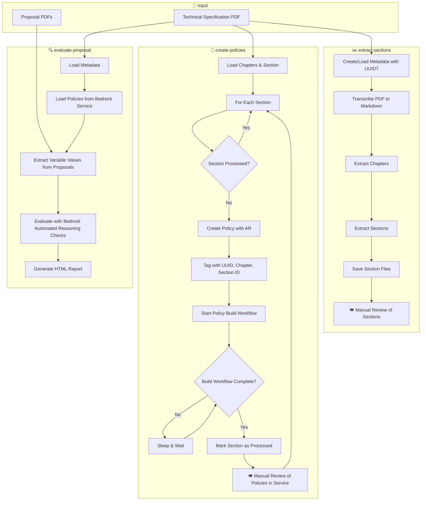

# Introduction

Amazon Bedrock Automated Reasoning-powered design review assistant that extracts formal policies from technical specifications and evaluates proposal compliance using Guardrails.

The tool parses policies to extract variable values from proposal documents, then uses Guardrails to evaluate whether the proposals conform to the technical specifications.

> **⚠️ DISCLAIMER**: This is a sample proof-of-concept (PoC) for demonstration purposes only. It is not suitable for production use and should not be deployed in production environments without significant additional development, testing, and security hardening.

# Requirements

The code has been tested to work with:

- Python 3.13.
- AWS Account with Bedrock Automated Reasoning + Claude Sonnet 4.5 access in Bedrock.
- The requirements in [`requirements.txt`](requirements.txt) (`pip install -r requirements.txt`).

# Steps

The following diagram illustrates the three main workflows available via CLI subcommands:



Key features:
- **Modular workflow**: Three independent subcommands for extract-sections, create-policies, and evaluate-proposal
- **Metadata tracking**: Each technical specification gets a UUID7 identifier stored in a metadata file in the transcription directory
- **Service-based policies**: Policies are stored in Bedrock Automated Reasoning service, tagged with document UUID, chapter number, and section ID
- **Dual-level tracking**: Metadata tracks both chapter-level and section-level processing status
- **Incremental processing**: Only unprocessed sections are sent to policy creation, avoiding redundant work
- **Single source of truth**: Bedrock service is the authoritative source for policies, enabling review and editing in the service itself

All the steps involving GenAI (metadata extraction, transcription, section extraction, policy creation) are lazy-loaded from a cache to ensure that they're only processed once.

# Usage

## Command Line

The tool provides three subcommands for modular execution:

### 1. Extract Sections

Convert the technical specification PDF to Markdown and extract sections for review:

```bash
python main.py extract-sections --spec data/specification.pdf \
                                 --transcription-dir artifacts/spec_name
```

This will export sections as markdown files to the specified transcription directory.

### 2. Create Policies

Extract formal policies from the technical specification and store them in Bedrock Automated Reasoning service:

```bash
python main.py create-policies --spec data/specification.pdf \
                                --transcription-dir artifacts/spec_name
```

This will create policies in the Bedrock service, tagged with the document's UUID for traceability. If sections were previously extracted, it will load them automatically. Policies are stored in the service and can be reviewed/edited there.

### 3. Evaluate Proposal

Evaluate proposals against the technical specification and generate a compliance report:

```bash
python main.py evaluate-proposal --spec data/specification.pdf \
                                  --proposals data/proposal1.pdf data/proposal2.pdf \
                                  --output artifacts/report.html \
                                  --transcription-dir artifacts/spec_name
```

This will check compliance against proposals (max 4 PDFs) and generate an interactive HTML report. Policies are loaded from the Bedrock service automatically.

### Full Workflow

Run all steps sequentially:

```bash
python main.py extract-sections --spec data/specification.pdf \
                                 --transcription-dir artifacts/spec_name
python main.py create-policies --spec data/specification.pdf \
                                --transcription-dir artifacts/spec_name
python main.py evaluate-proposal --spec data/specification.pdf \
                                  --proposals data/proposal1.pdf data/proposal2.pdf \
                                  --output artifacts/report.html \
                                  --transcription-dir artifacts/spec_name
```

Each step is incremental - later steps will automatically use outputs from previous steps if available. A metadata file (`{spec_name}.metadata.json`) is created in the transcription directory to track processing state and maintain traceability with service-stored policies.

## Configuration

You can configure certain behaviours of the program by creating a `.env` file. The excerpt below also provides
their names and default values:

```env
DATA_DIR=data
CACHE_DIR=data/cache
OUTPUT_DIR=artifacts
MAX_DOCUMENT_SIZE_MB=4.5
LOG_LEVEL=INFO
AWS_DEFAULT_REGION=us-west-2
```

## Basic Processing

```python
from pathlib import Path
from policies.documents import TechnicalSpec

# Process a technical specification
doc = TechnicalSpec(file_path=Path('data/specification.pdf'))

# Access metadata (includes document UUID for traceability)
print(doc.title, doc.revision, doc.author, doc.publication_date)
print(f"Document UUID: {doc.metadata.document_uuid}")

# Access chapters and policies (automatically creates/loads from Bedrock service)
for chapter in doc.chapters:
    print(f"Chapter {chapter.number}: {chapter.title}")
    for policy in chapter.policies:
        print(f"  Policy: {policy.name}")
```

## Check Compliance and Generate HTML Report

```python
# Check compliance of proposal documents against the technical specification
proposal_paths = [Path('data/proposal.pdf')]
resolved_policies = doc.check_compliance(proposal_paths)

# Generate interactive HTML report with embedded documents
doc.to_html_report(resolved_policies, Path('output/compliance_report.html'))
```

The HTML report provides:
- Hierarchical view of chapters and policies
- Resolved variable values from the proposal
- Compliance comments from automated reasoning
- Embedded PDF viewers for both technical specification and proposal documents
- Interactive navigation with collapsible sections
- Clickable variables that navigate to their source location in the embedded PDF

## Project Structure

```
genai-aided-design-reviews/
├── policies/          # Policy processing
│   ├── documents.py   # Document processing
│   └── builder.py     # Policy creation and service integration
├── models/            # Data models
│   ├── technical_spec.py  # Document metadata models
│   ├── arc.py         # Automated Reasoning models
│   ├── findings.py    # Compliance findings
│   └── bedrock.py     # Bedrock integration
├── data_io/           # Input/output operations
│   ├── section_extraction.py  # Section extraction
│   └── html_report.py         # HTML report generation
├── misc/              # Configuration
│   └── config.py      # Configuration management
├── main.py            # CLI entry point
└── requirements.txt   # Dependencies
```
